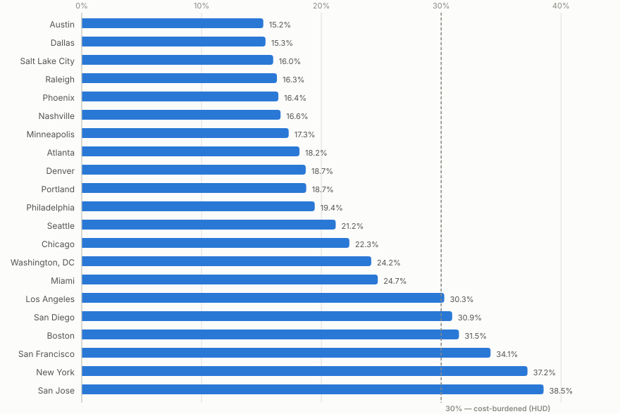

# Tech Affordability Index

### → **[Live site](https://varadmore.me/Tech-affordability-index/)** · **[Method](https://varadmore.me/Tech-affordability-index/method.html)**

**What salary does a place actually need — and does your offer clear it?**

Cost-of-living calculators go stale and quietly compare *gross* salaries, as if a
$156k offer meant the same thing in Austin and Manhattan. This works out what a
county costs to live in — rent **plus** everything else — and the salary that
covers it, measured against **take-home pay** after federal, state, city and
payroll tax.

Every US county. Current tax law. Sources you can check.



---

## The question it answers

Most tools answer a *relative* question: given a salary, where does it stretch
furthest? That produces a ranking, but a ranking never says whether anything on
it is affordable. Two places with an identical 28% rent burden are not equally
livable if one has materially higher transport and medical costs.

So the model here is **absolute**:

```
needs = rent + everything else       (monthly, after tax)
```

and three salary thresholds fall out of it, each anchored to a published
budgeting standard rather than a number chosen because it looked reasonable:

| Threshold | Rule | Standard |
|---|---|---|
| **Survival** | needs = 100% of take-home | MIT living wage — a subsistence budget with no savings |
| **Getting by** | needs = 70% of take-home | the 70/20/10 budget |
| **Comfortable** | needs = 50% of take-home | the 50/30/20 rule |

Those salaries are found by **inverting the tax engine** numerically, so they
stay correct for every state, bracket, payroll levy and city tax automatically —
including the kinks at the Social Security wage cap and the Additional Medicare
threshold, which have no closed form.

## Data

| What | Source | Coverage | Refresh |
|---|---|---|---|
| Rent, current | Zillow ZORI | ~1,360 counties + 21 metros | monthly, by CI |
| Rent, complete | Census ACS B25064 | 3,123 of 3,142 counties | annual |
| Everything else | MIT Living Wage Calculator | 3,133 counties | annual |
| Tax | Tax Foundation / IRS / SSA | all 50 states + DC | yearly |
| Compensation | Levels.fyi | 7 entry-level packages | dated snapshot |
| Boundaries + names | us-atlas + Census gazetteer | 3,142 counties | static |

**The two rent measures are never mixed into one number.** A single national
ZORI/ACS multiplier was tested against the 1,351 counties carrying both and
rejected — correlation 0.675, median error 11%, 90th-percentile error 27%, with
Pitkin County (Aspen) off by a factor of nine. You switch between them; the site
never converts one into the other.

## What it shows

| View | Answers |
|---|---|
| **Salary ladder** | What does survival cost here, and what does comfortable cost? |
| **Cost breakdown** | Where does the money actually go — groceries, transport, healthcare? |
| **County map** | Where in the country does this salary go furthest? |
| **Ranked bars** | Across the 21 tech hubs, where does rent eat least of monthly pay? |
| **Heatmap** | How do all 21 hubs compare across every reference offer at once? |
| **Small multiples** | How does it change over four years as equity vests? |

## Running it

**Zero runtime dependencies** — the deployed site is flat files with no build
step and no database. Playwright is a dev dependency, used only for tests.

```bash
npm run serve        # http://localhost:4173
npm test             # tax engine, bands, projection, ingest, page claims
npm run test:e2e     # browser: asserts the charts actually drew
npm run test:all     # both

npm run refresh      # all three rent sources
npm run fetch-county-living-wage   # cost of living, MIT (resumable)
npm run build-basemap              # boundaries + gazetteer -> projected SVG paths
```

Deploying: enable GitHub Pages with **GitHub Actions** as the source. `ci.yml`
runs unit tests, then browser tests, then publishes on every push to `main`.

## Things worth knowing about the code

**The map projection is hand-rolled and verified.** The site loads no CDN, so
Albers USA is implemented from scratch in `src/projection.js`. To be sure that
"from scratch" did not mean "subtly wrong", it was checked against `d3-geo`
across 27 named locations and 4,982 grid points — including the antimeridian,
where the Aleutians cross from +179° to −179°. Agreement was exact to
floating-point precision, and the fixtures are committed so the tests keep
pinning it.

**Every ingest fails loudly.** If a source is unreachable or its format changes,
the script exits non-zero and the last good data stays committed — stale numbers
still labelled with their real date. Nothing substitutes placeholders, because a
pipeline that silently falls back to hardcoded values looks identical to a
working one. That is not hypothetical: it is exactly what this project did
before the rewrite, for its entire existence.

**The tests pin the prose, not just the code.** The unit suite asserts the
factual claims the pages make about the reference offers — that Google's
front-loaded grant decays, that Amazon's back-loaded one climbs past it, that the
evenly-vesting offers stay flat. If the data changes so a claim stops holding,
the tests fail and flag the wording as stale. A sentence the numbers no longer
support is a correctness bug, not a wording nit.

**There are browser tests because HTTP 200 proves nothing.** The page renders
entirely from client-side ES modules; a broken import returns 200 with an empty
panel while asset checks and unit tests both pass. The Playwright suite asserts
the charts actually drew — every county painted, bars in ascending order, the
breakdown summing to its stated total, tooltips, dark mode surviving navigation,
and no horizontal overflow at three widths.

## Layout

```
index.html            the tool
method.html           full methodology, sources and limitations
assets/               rendering — charts.js and map.js are hand-rolled SVG, zero deps
src/tax.js            tax engine (holds no constants)
src/tax-data.js       every bracket and rate, each with its source
src/bands.js          survival / getting by / comfortable, by inverting the tax engine
src/projection.js     Albers USA, pinned to d3-geo by fixture
scripts/              ingests — each fails loudly, none falls back
data/                 committed, dated, diffable
test/                 node --test
e2e/                  playwright
```

Rolling to a new tax year means editing `src/tax-data.js` and nothing else.

## Known limitations

The [method page](https://varadmore.me/Tech-affordability-index/method.html)
carries the full list. The ones that bite hardest:

- **Local income tax is modelled for two cities only** — New York City and
  Philadelphia, the two whose rates could be verified against the taxing
  authority. About a third of counties with data sit in states levying some local
  income tax; those carry an on-screen warning and their take-home is overstated.
- **Compensation is not location-adjusted.** Real packages run 15–25% lower in a
  tier-3 metro than in the Bay Area, but no authoritative per-metro table is
  published and DOL's filed-wage data is bot-blocked. Edit the salary field.
- **Single filer, standard deduction, county-level geography.**
- **On the Zillow basis, utilities are missing** — ZORI excludes them and MIT
  puts them in the housing row this project discards. The Census basis includes
  them.

## Sources

- [Zillow Research — ZORI](https://www.zillow.com/research/data/)
- [US Census Bureau — American Community Survey](https://www.census.gov/programs-surveys/acs)
- [MIT Living Wage Calculator](https://livingwage.mit.edu/)
- [Tax Foundation — 2026 federal brackets](https://taxfoundation.org/data/all/federal/2026-tax-brackets/)
- [Tax Foundation — 2026 state brackets](https://taxfoundation.org/data/all/state/state-income-tax-rates-2026/)
- [SSA — contribution and benefit base](https://www.ssa.gov/oact/cola/cbb.html)
- [Levels.fyi](https://www.levels.fyi/)
- [us-atlas](https://github.com/topojson/us-atlas)

## Licence

MIT.
